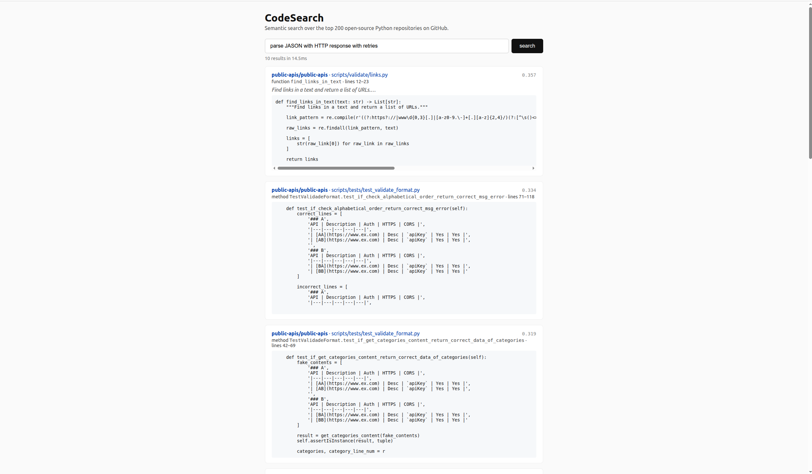

# CodeSearch

Semantic search over popular open-source Python repositories on GitHub. Ask a natural-language question like *"parse JSON from HTTP response with retries"* and get relevant functions from real libraries, ranked by semantic similarity, with links back to the source on GitHub.



## What it does

Three pipelines that run at different cadences:

1. **Ingestion** (offline, one-shot). Uses the GitHub Search API to find the top-starred Python repositories, downloads each as a tarball, walks every `.py` file, parses it with Python's `ast` module, and emits one JSON chunk per function, class, or method to `data/chunks.jsonl`.
2. **Index build** (offline, one-shot). Streams chunks from disk, computes a 384-dim embedding for each using `sentence-transformers/all-MiniLM-L6-v2` with L2 normalization, and adds them incrementally to a FAISS `IndexFlatIP` (exact inner-product search).
3. **Search API** (online). A FastAPI service loads the model and index into memory once at startup. Each `/search` request embeds the query, runs a top-K FAISS search, and returns hits with source, docstring, line ranges, and a GitHub deep-link. `/metrics` exposes Prometheus counters and a latency histogram.

## Architecture

```
┌─────────────────┐     ┌──────────────┐     ┌────────────────┐
│  Ingestion      │───▶ │  chunks      │───▶ │  Embedding +   │
│  GitHub API +   │     │  (JSONL)     │     │  FAISS index   │
│  Python `ast`   │     │              │     │  (streamed)    │
└─────────────────┘     └──────────────┘     └────────────────┘
                                                      │
                                                      ▼
                             ┌───────────────────────────────────┐
                             │  FastAPI /search                  │
                             │  loads model + index in memory    │
                             │  Prometheus metrics on /metrics   │
                             └───────────────────────────────────┘
                                                      │
                                                      ▼
                                           ┌────────────────┐
                                           │  React + Vite  │
                                           │  frontend      │
                                           └────────────────┘
```

## Design decisions

A few choices worth calling out, because they're the interesting parts of the project:

**Function-level chunking via Python's `ast` module.** I chose semantic boundaries (one chunk per function/class/method) over fixed-size line windows. A query for "parse JSON" should surface a function that parses JSON, not lines 40–60 of a class that happens to contain the word "JSON." Free-floating module-level code is dropped, which loses very little — in practice that's mostly imports and constants.

**Embedding composed strings, not raw code.** Each chunk is embedded as `"{kind} {name}\n{docstring}\n{source}"` rather than raw code. Name and docstring are natural language, which is what `all-MiniLM-L6-v2` was trained on. Raw code alone embeds poorly with a general-purpose sentence transformer. A code-specific model like CodeBERT would embed raw code well, but it isn't a sentence transformer and would need a different pipeline.

**Normalized vectors + `IndexFlatIP`.** Embeddings are unit-normalized at encode time. Combined with FAISS's inner-product index, this gives cosine similarity, which is the standard metric for semantic search. Flat (brute-force) search is O(N·D) per query — at 2.2M chunks × 384 dims that's ~845M multiplies per query, ~200ms on my machine. If the corpus grew further or latency needed to be sub-50ms, I'd switch to `IndexIVFFlat` or `IndexHNSW` and measure the recall/latency tradeoff.

**Streaming index build.** The build script processes chunks in batches of 5,000, embedding each batch and adding to the FAISS index incrementally. Metadata is written to disk during the loop rather than held in memory. Peak memory stays bounded (~a few hundred MB) regardless of corpus size — an earlier version that loaded all chunks into RAM OOM-killed at ~2M chunks.

**Model + index loaded once at startup, not per request.** Held in memory in the FastAPI `lifespan` context. The model is warmed with a dummy query at startup so the first real request doesn't pay the HuggingFace download or JIT-warmup cost.

**Offline index build.** Ingestion and index build are one-shot scripts producing on-disk artifacts (`chunks.jsonl`, `faiss.index`, `metadata.jsonl`). The serving process is stateless besides reading those files. This means the serving container can restart in seconds and the index can be rebuilt without redeploying the API.

## Repository layout

```
codesearch/
├── backend/
│   ├── main.py               # FastAPI app + endpoints
│   ├── search.py             # SearchService: embedder + index glue
│   ├── config.py             # Env-var settings (pydantic-settings)
│   ├── models.py             # Pydantic models (CodeChunk, SearchRequest/Response)
│   ├── metrics.py            # Prometheus counters + latency histogram
│   ├── ingestion/
│   │   ├── github_client.py  # async httpx client + tarball extraction
│   │   ├── chunker.py        # AST-based function/class extractor
│   │   └── ingest.py         # end-to-end ingestion script
│   ├── embedding/
│   │   └── embedder.py       # sentence-transformers wrapper
│   └── index/
│       └── faiss_index.py    # FAISS build/save/load/search
├── scripts/
│   ├── build_index.py        # streaming embed + FAISS build
│   └── benchmark.py          # latency benchmark harness
├── frontend/                 # React + Vite UI
├── tests/                    # pytest tests for chunker
├── Dockerfile                # multi-stage: frontend build + Python runtime
├── fly.toml                  # Fly.io deployment config (not yet deployed)
└── pyproject.toml            # Python dependencies (pinned)
```

## Local setup

Prereqs: Python 3.11+, Node 20+.

```bash
git clone https://github.com/MirisanRavindran/codesearch
cd codesearch

# Python deps
pip install uv
uv venv
source .venv/bin/activate         # Windows: .venv\Scripts\activate
uv pip install -e ".[dev]"

# GitHub token so you don't hit rate limits.
# Generate at https://github.com/settings/tokens (no scopes needed).
export GITHUB_TOKEN=ghp_...

# Start small to verify the pipeline
export NUM_REPOS_TO_INGEST=10
python -m backend.ingestion.ingest         # produces data/chunks.jsonl
python scripts/build_index.py              # produces data/faiss.index + data/metadata.jsonl

# API on :8000
uvicorn backend.main:app --reload

# Frontend on :5173 (in a second terminal)
cd frontend
npm install
npm run dev
```

Then open http://localhost:5173.

Once the pipeline is verified with a small corpus, re-run ingest and build with `NUM_REPOS_TO_INGEST=200` for the full corpus. Ingestion takes ~1.5 hours (network-bound on tarball downloads). Index build takes ~45 minutes on GPU or ~2 hours on CPU. The resulting artifacts total ~9.6 GB on disk.

## Benchmarks

Measured on a local machine with an NVIDIA CUDA GPU. Both GPU and CPU-only configurations were benchmarked because the deployment target is CPU-only (Fly.io shared-cpu-1x).

### Corpus and index

| Metric | Value |
|---|---|
| Repositories ingested | 200 (top-starred Python) |
| Total chunks indexed | 2,186,164 |
| FAISS index size on disk | 3.2 GB |
| Metadata size on disk | 3.3 GB |
| Embedding model | `sentence-transformers/all-MiniLM-L6-v2` |
| Embedding dim | 384 |
| Index type | `IndexFlatIP` (exact inner product) |
| Cold-start time (load index + warm model) | ~24 s |

### Search latency

125 requests: 25 varied natural-language queries × 5 runs against a warm index. Query text and script are in [`scripts/benchmark.py`](scripts/benchmark.py). Latency measured client-side over localhost.

|             | p50    | p95    | p99    | min    | max    | avg    |
|---|---|---|---|---|---|---|
| GPU (CUDA)  | 164 ms | 202 ms | 202 ms | 163 ms | 202 ms | 175 ms |
| CPU-only    | 161 ms | 189 ms | 195 ms | 158 ms | 199 ms | 163 ms |

**Why GPU doesn't help meaningfully at this scale.** The search request has two hot paths: (1) query embedding via sentence-transformers, and (2) FAISS `IndexFlatIP.search` doing an exact linear scan over 2.2M × 384-dim vectors. `faiss-cpu` runs step (2) on the CPU regardless of GPU availability, and at this corpus size it dominates the request — probably 150–180ms of the ~200ms total. The GPU only speeds up step (1), which is worth ~10–15ms, comfortably inside the run-to-run variance (min-max spread is ~40ms). To materially cut latency, the next step is to trade exact search for approximate: `IndexIVFFlat` with ~1024 clusters would give sublinear search and likely drop p99 into the 30–80ms range with a small measurable recall loss.

**On sample size.** With 125 samples the p99 estimate is coarse — the 124th sorted value doesn't distinguish "true p99 = 195ms" from "true p99 = 205ms." A tighter estimate would need ~1000+ requests. Good enough to state the order of magnitude, not fine-grained enough for a production SLO.

### Recall

| Metric | Value |
|---|---|
| Recall@10 on curated benchmark | *not yet measured (see "Things I'd do next")* |

## Observability

`GET /metrics` exposes Prometheus metrics:

- `codesearch_search_requests_total{status}` — request counter labeled by status
- `codesearch_search_latency_seconds` — end-to-end latency histogram with buckets tuned for search (10ms to 5s)
- `codesearch_search_errors_total{kind}` — error counter labeled by error type

`GET /healthz` for liveness (used by Docker/Fly.io healthchecks).

## Deployment (planned, not yet done)

A multi-stage Dockerfile is provided (Node build for the frontend, Python runtime for the backend). A Fly.io config (`fly.toml`) is included as a starting point. The FAISS index is not baked into the image — it's intended to be mounted from a persistent volume so it can be rebuilt independently of API deploys.

To deploy:

```bash
fly launch --no-deploy                     # customize the generated fly.toml
fly volumes create codesearch_data --size 10 --region yyz
# upload data/faiss.index and data/metadata.jsonl into the volume
fly deploy
```

## Things I'd do next

Explicitly listing these because being honest about a project's current state is more useful than pretending it's finished. Roughly in the order I'd tackle them:

- **Corpus quality filter.** The top-Python-repos list from GitHub Search includes some "awesome list" or curated-index repos (e.g. `public-apis/public-apis`) that are mostly markdown with only a small validation script. These add noise to search results without adding useful code. Filter by minimum `.py` file count or exclude repos tagged as tutorials/awesome-lists.
- **Recall@10 evaluation harness.** Curate ~30 queries with known-correct answers, measure recall over the full corpus after each change. Currently there's no way to tell empirically if a change made retrieval better or worse.
- **Switch to `IndexIVFFlat` and quantify the tradeoff.** `IndexFlatIP` is O(N·D) per query. `IndexIVFFlat` with 1024 clusters would give sublinear search — likely p99 in the 30–80ms range instead of ~200ms — with a small recall drop. Measure the drop against Flat on the eval set above and pick the operating point.
- **Hybrid BM25 + semantic ranking.** Pure semantic search misses exact-identifier queries (e.g. searching `reduce_sum` should surface the literal function). Add a BM25 keyword ranker with a tunable blend weight (`rank_bm25` does most of the work in ~50 lines).
- **In-memory LRU cache** for `(query, top_k)` — most queries in a typical usage pattern are near-duplicates.
- **Rate limiting** with `slowapi` — token bucket per IP, e.g. 60 req/min.
- **Second-language support via tree-sitter** — same architecture, different parser, unlocks Go/JavaScript/Rust corpora.
- **Deploy to Fly.io** with the persistent-volume setup described above.

## Testing

```bash
pytest tests -v
```

Starter tests cover the chunker; extend with tests for the search service, embedder, and API contract.

## License

MIT.
